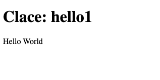

Clace applications implement a [Hypermedia driven approach](https://hypermedia.systems/hypermedia-reintroduction/) for developing web applications. Applications return HTML fragments as API response using [Go html templates](https://pkg.go.dev/html/template). The UI uses HTML enhanced with hypermedia controls using the [HTMX library](https://htmx.org/) to implement user interactions.

The backend API routes and dependencies like CSS library, JavaScript modules etc are configured using [Starlark](https://github.com/google/starlark-go/blob/master/doc/spec.md) configuration. Any custom API handling required is implemented in handler functions also written in Starlark. Starlark is a subset of python, optimized for application configuration usecases.

## Structure

The structure of a Clace application is:

- One Clace application per folder, `static` sub-folder contain static assets
- An `app.star` Starlark file, defining the application configuration
- Predefined builtins, accessed through the `ace` namespace
- A global called `app`, created using `app = ace.app()` call
- An optional default handler function called `handler`. Other handlers are referenced in the route config
- An html template file called `index.go.html` if using custom layout
- If not using custom layout, an html template block called `clace_body` defined in any `*.go.html` file, for example `app.go.html`

## App Lifecycle

The Clace app development lifecycle is:

- Create a folder for the app, with the app.star file and templates.
- Start the Clace server. Create an app using `clace app create --is_dev`. This runs the app in dev mode.
- In dev mode, some additional files are generated, with `_gen` in the file name. CSS dependenccies and JavaScript modules are downloaded into the `static` folder.
- After the app development is done, the whole app folder can be checked into source control. There is no build step.
- Create a production app, `clace app create`, without the `--is_dev`. The app is now live. The Clace server can host multiple applications, each application has a dedicated path and optionally a dedicated domain.

## Examples

### Simple App

The simplest app, using the default builtin layout would be two files. An `app.star` file containing

```python
app = ace.app("hello1", pages = [ace.page("/")])
```

and an `app.go.html` file containing

<!-- prettier-ignore -->
```html
{{block "clace_body" .}}
   Hello World
{{end}}
```

<!-- prettier-ignore-end -->

Create an app in dev mode with this code and vising the app url will show


The name of the app is hello1. There is only one route defined, for page /, which shows a HTML page with the name of the app. The body is generated from the contents of the app.go.html file. A more verbose way to write the same app config would be

```python
app = ace.app(name="hello1",
              custom_layout=False,
              pages = [ace.page(path="/", html="index_gen.go.html")]
             )
```

`index_gen.go.html` is the auto generated index file, created when the default builtin layout is used.

### App with Custom Layout

To create a app with a custom HTML page which shows a listing of files in your root directory, create an `app.star` file with

```python
load("exec.in", "exec")

def handler(req):
   ret = exec.run("ls", ["-l", "/"])
   return {"Lines": ret.lines}

app = ace.app("hello1",
              custom_layout=True,
              pages = [ace.page("/")],
              permissions = [ace.permission("exec.in", "run", ["ls"])]
             )
```

and an `index.go.html` file with

<!-- prettier-ignore -->
```html
<!doctype html>
<html>
  <body>
    {{ range .Data.Lines }}
       {{.}}
       <br/>
    {{end}}
  </body>
</html>
```

This app uses the exec plugin to run a ls command. The output of the command is shown when th app is accessed. To allow the app to run the plugin command, use the `clace app audit --approve` command.

<!-- prettier-ignore-end -->

## More examples

There are more examples [here](https://github.com/claceio/clace/tree/main/examples). The disk_usage example uses the MVP classless library for styling and shows a basic hypermedia flow. The cowbull game examples has multiple [pages](https://github.com/claceio/clace/blob/1f2ca6b09a73112dc8c97cb0575942dba4d75f89/examples/cowbull/app.star#L89), each page with some dynamic behavior. Clace does not currently have a persistence layer. The cowbull game depends on another service for data persistence, so it is implementing a backend for frontend pattern. For styling, it uses the [DaisyUI](https://daisyui.com/) component library for Tailwind CSS. These two examples work fine with Javascript disabled in the browser, falling back to basic HTML without any HTMX extensions.

The memory_usage example uses the [d3](https://d3js.org/) library to show a interactive display of the memory usage for processes on the machine. The plot library is [automatically imported](https://github.com/claceio/clace/blob/1f2ca6b09a73112dc8c97cb0575942dba4d75f89/examples/memory_usage/app.star#L103) as a ECMAScript module and the custom [javascript code](https://github.com/claceio/clace/blob/main/examples/memory_usage/static/js/app.js) works with a [JSON api](https://github.com/claceio/clace/blob/1f2ca6b09a73112dc8c97cb0575942dba4d75f89/examples/memory_usage/app.star#L98) on the backend. The default in Clace is hypermedia exchange, JSON can be used for data API's.
